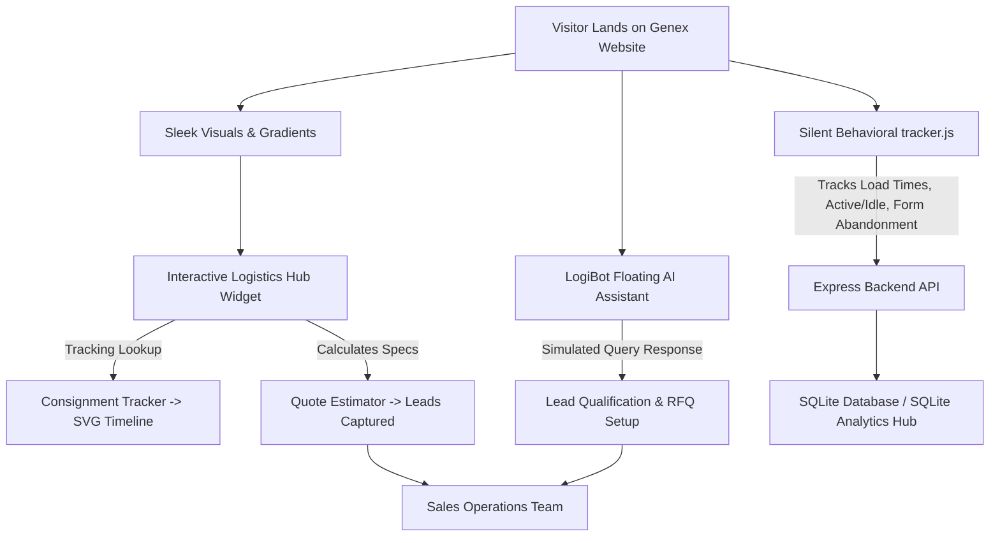
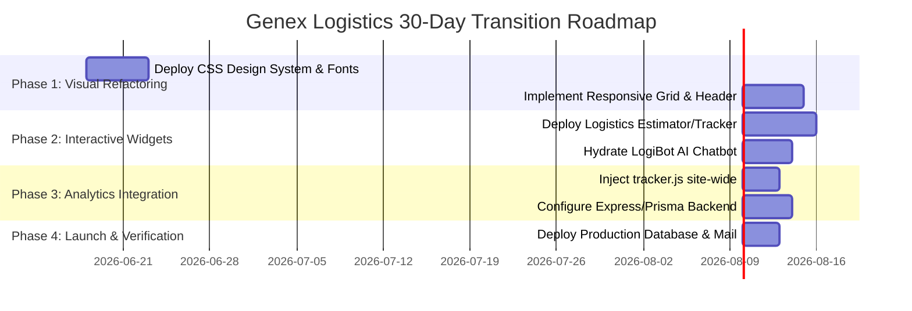

# Genex Logistics Digital Growth Strategy
## Website Audit, Conversion Rate Optimization (CRO), and Refactoring Roadmap

This document provides a comprehensive audit and digital growth strategy for **Genex Logistics** ([genexlogistics.in](https://www.genexlogistics.in/)). It outlines the conversion bottlenecks of the current legacy website, presents a design-first UX/UI solution framework, and describes the full-stack analytics pipeline designed to convert passive website traffic into qualified B2B contract logistics leads.

---

## 1. Executive Summary

Genex Logistics has established a strong operational foundation since 2011, managing over **5 Million square feet** of warehousing space across India and serving high-complexity sectors like Automotive, Pharma, and E-commerce. However, their primary digital storefront ([genexlogistics.in](https://www.genexlogistics.in/)) acts as a static brochure rather than an active marketing engine. 

For B2B procurement heads and supply chain directors, a logistics partner's website is the first indicator of their operational sophistication. In an industry where "a missed SLA stops a production line," a static, slow, and dated website signals a low-tech backend. 

### Core Thesis
By refactoring the legacy website into a **responsive, high-fidelity portal** with integrated interactive tools (such as consignment tracking and cargo estimators), site-wide conversational AI (**LogiBot**), and a silent behavioral analytics pipeline (**tracker.js**), Genex Logistics can transition its digital presence from a cost center into a high-yield B2B lead generation pipeline.

---

## 2. Comparative Audit: Legacy vs. Refactored Staging

The following table contrasts the critical visual, structural, and marketing deficiencies identified on the production website against the optimized solutions implemented in the refactored staging environment:

| Feature / Dimension | Original Production Website ([genexlogistics.in](https://www.genexlogistics.in/)) | Refactored & Optimized Template | Business & Growth Impact |
| :--- | :--- | :--- | :--- |
| **Hero Value Proposition** | Flat typography, low contrast, value proposition is buried. | Dynamic layout with bold headers, HSL gradient text, and visible focus. | **Reduces Bounce Rate:** Instantly communicates JIT and 3PL specialization within 3 seconds. |
| **Call-To-Action (CTA) Hooks** | No prominent CTAs in the hero section or header navigation. | Primary "Get a Quote" and "Partner With Us" buttons placed at high-visibility positions. | **Higher Conversion:** Provides direct paths to contact from every single page. |
| **Utility Integrations** | Shipment tracking is a static text link routing to a blank/placeholder page. | Dual-tab interactive widget with SVG progress tracking and client-side pricing calculator. | **Demonstrates Tech Edge:** Shows clients that Genex operates with digital transparency. |
| **Industry & Service Pages** | Dense, non-scannable bullet points and massive blocks of text. | Interactive tabbed menus with customized industry-specific metrics and SVG icons. | **Reduces Cognitive Load:** Lets users easily scan vertical capabilities (Pharma cold-chain vs Hazmat). |
| **Social Proof & Authority** | No client testimonials, ISO certifications, or high-level operational metrics. | Animated counters (5M+ Sq. Ft, 99.9% SLA, 500+ Vehicles) and client testimonial slider. | **Establishes Credibility:** Uses statistical authority to build immediate trust. |
| **Case Studies Presentation** | Hidden behind dry text links without structural outcomes. | Highlighted visual cards showcasing metrics (e.g. `+35% SLA Efficiency`, `-20% Transit Time`). | **Proves Competence:** Provides proof-of-work in problem-solution-result format. |
| **User Ingestion & Tracking** | Standard server logs, missing analytics or user interaction tracking. | Custom client-side [tracker.js](file:///d:/project%201/tracker.js) tracking active time, page speed, and form exits. | **Continuous Improvement:** Delivers behavioral data to optimize lead generation funnels. |
| **Customer Support & Lead Capture**| Limited to email addresses and manual contact form submissions. | Interactive glassmorphic [LogiBot](file:///d:/project%201/chatbot.js) floating chat with pre-qualification paths. | **24/7 Operations:** Captures high-intent leads even during offline operational hours. |

---

## 3. The Interactive Growth & Conversion Architecture

The refactored platform leverages three primary interactive hubs to capture, score, and convert traffic.



### A. The Logistics Hub Widget
Located immediately below the hero fold, this dual-panel element captures user intent:
1. **Consignment Tracker**: Promotes transparency. Users entering a consignment ID (e.g., `GNX-10294`) receive an immediate, simulated multi-stage SVG timeline illustrating sorting, transit, and delivery milestones.
2. **Instant Quote Estimator**: A frictionless pricing calculator. Users select their service, cargo weight, and industry vertical (e.g., E-commerce, Pharma) to see an instant base rate estimate. This encourages users to request a formal quotation.

### B. AI-Powered Chat Assistant: LogiBot
Built as a floating, glassmorphic panel loaded site-wide, **LogiBot** fulfills multiple roles:
- **Instant Tracking Lookup**: Resolves shipment statuses directly in the chat window.
- **Lead Qualification**: Guides users through short quick-reply options (e.g., "Request Quote", "Partner Inquiries") to pre-qualify their company size and logistical requirements before routing to human sales desks.
- **Fallback Form**: Converts conversational inputs into structured database entries.

### C. Client-Side Behavioral Analytics Tracker (`tracker.js`)
Unlike generic analytics scripts, [tracker.js](file:///d:/project%201/tracker.js) is custom-configured to capture high-value indicators:
- **Time-to-First-Byte (TTFB) & Load Time**: Tracks page loading performance.
- **Active vs. Idle State**: Detects if a user is idle for more than 15 seconds.
- **Form Abandonment Hooks**: Identifies fields filled out before a user abandons a form, enabling sales teams to follow up on partial leads.
- **Exit Beacons**: Uses `navigator.sendBeacon` to write interaction history to the database without delaying page unloading.

---

## 4. Full-Stack Ingestion Pipeline

The backend analytics database uses a modern, light-footprint configuration to collect leads and behavioral statistics.

> [!NOTE]
> The current setup runs on a Node.js/Express framework coupled with Prisma ORM and SQLite, making it highly portable for local testing and staging.

```
[tracker.js (Client)] 
       │
       ▼ (HTTP POST /api/analytics)
[Express Server (server.js)] ───► [Prisma Client] ───► [SQLite Database (dev.db)]
       │
       ▼ (On Contact Form / Lead Capture)
[Nodemailer Dispatcher] ───► Email Notification to: solutions@genexlogistics.in
```

### Key Technical Enhancements In Staging
- **Location Resolution**: Uses `geoip-lite` to resolve approximate locations of incoming RFQs based on client IP addresses.
- **Browser Fingerprinting**: Uses `ua-parser-js` to store device details, helping developers optimize responsive structures for mobile and tablet setups.
- **Spam Protection**: Integrates `express-rate-limit` and `express-validator` to ensure that inbound forms are clean, protected, and free from automated spam.

---

## 5. SEO Optimization Strategy

For a B2B logistics company, visibility on search engine results pages (SERPs) for industrial keywords is critical. The optimized site includes built-in SEO enhancements:

1. **Semantic HTML5 Layout**: Standardizes headings (`h1` for page titles, `h2` for main content blocks, `h3` for cards) and landmarks (`<header>`, `<main>`, `<section>`, `<footer>`) to maximize crawler readability.
2. **On-Page Keyword Mapping**: Integrates commercial-intent search terms naturally across titles, metadata, and copy:
   - *Primary Keywords*: "3PL supply chain India", "Contract warehousing services", "JIT parts logistics".
   - *Secondary Keywords*: "Pharma cold chain warehousing", "Express road LTL distribution", "Customs clearing agent Delhi".
3. **Structured Meta Tags**: Every page possesses custom titles and descriptions (e.g., [index.html](file:///d:/project%201/index.html) maps specialized metadata tailored to "Premium 3PL Warehousing").

---

## 6. Implementation Roadmap: 30-Day Transition

To bridge the gap between their current legacy website and the optimized platform, we recommend a phased 30-day implementation plan.



### Phase 1: Visual Refactoring (Days 1–10)
- Replace legacy stylesheets with the optimized [index.css](file:///d:/project%201/index.css) design system.
- Standardize the modern typography stack ('Inter' and 'Outfit' Google Fonts).
- Implement responsive grids, mobile navigation toggles, and clean header layouts.

### Phase 2: Interactive Widgets & Hydration (Days 11–20)
- Embed the dual-tab Consignment Tracker & Instant Quote Estimator on the homepage.
- Configure client-side event handlers in [index.js](file:///d:/project%201/index.js) to drive mock calculations.
- Deploy the [chatbot.js](file:///d:/project%201/chatbot.js) LogiBot script across all pages.

### Phase 3: Ingestion Pipeline & Analytics (Days 21–26)
- Inject [tracker.js](file:///d:/project%201/tracker.js) into the footer of all templates.
- Spin up the Express backend on staging (or inside a Docker container) and initialize Prisma database clients.
- Verify that visibility changes, click events, and form abandonment logs write correctly to the database.

### Phase 4: Launch & Verification (Days 27–30)
- Swap the SQLite database for a production PostgreSQL instance by altering connection environment variables.
- Connect Nodemailer transport services to the official SMTP credentials to route incoming lead notifications to the sales team (`solutions@genexlogistics.in`).
- Validate responsiveness, page performance, and mobile compatibility.

---

## 7. Key Strategic Decisions Required

> [!IMPORTANT]
> The following parameters require stakeholder confirmation before final production merge:
> 
> 1. **Live Consignment Integration**: Should the Consignment Tracker query a live internal ERP/WMS API in real-time, or is a mock simulator sufficient for launch?
> 2. **Quote Pricing Thresholds**: Are the default multipliers used in the Quote Estimator (Automotive: 1.5, Pharma: 2.2, E-commerce: 1.2) representative of actual pricing guidelines?
> 3. **Lead Routing Email**: Should lead notifications continue to route directly to `solutions@genexlogistics.in`, or should they plug directly into a CRM (e.g., Salesforce, Zoho CRM)?
